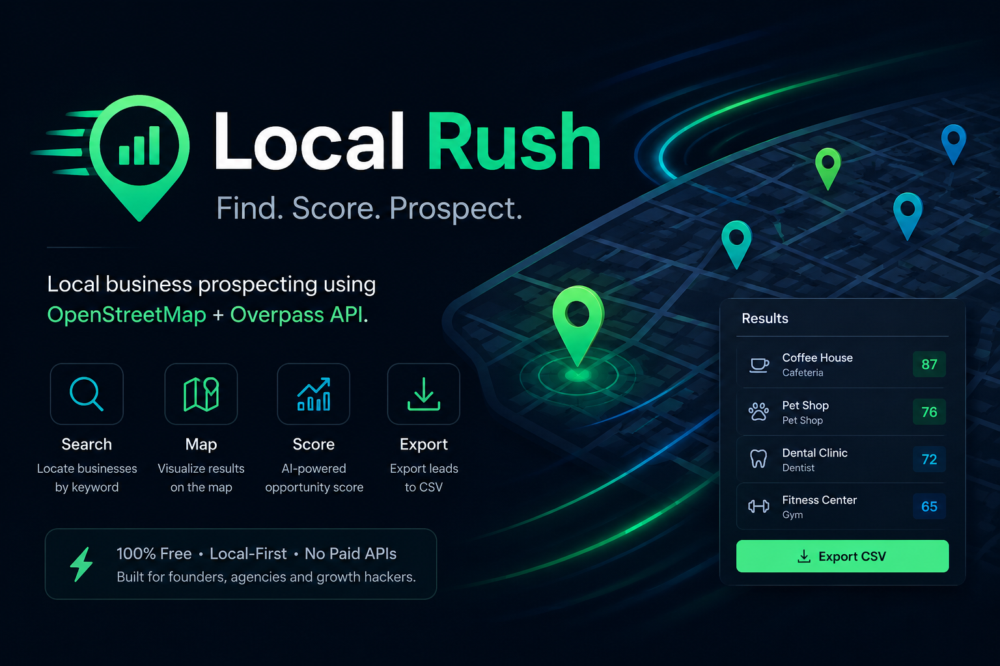

# Local Rush



<p align="center">
  <strong>Local business prospecting using OpenStreetMap + Overpass API.</strong>
</p>

<p align="center">
  MVP local-first para geração de leads comerciais sem APIs pagas.
</p>

---


---

# Sobre o Projeto

Local Rush é um MVP de prospecção comercial local que busca empresas próximas usando dados gratuitos do OpenStreetMap através da Overpass API.

O projeto foi construído com foco em:

- simplicidade;
- baixo custo operacional;
- execução local;
- velocidade de desenvolvimento;
- validação rápida de ideias.

Não utiliza:
- banco de dados;
- autenticação;
- Docker;
- APIs pagas;
- frameworks frontend.

Tudo roda localmente usando FastAPI + HTML/CSS/JavaScript puro.

---

# Preview

## Dashboard


## Resultados


---

# Features

- Busca de empresas próximas
- Integração com OpenStreetMap
- Integração com Overpass API
- Score automático de oportunidade
- Filtro "apenas empresas com website"
- Geolocalização automática
- Links rápidos para:
  - website
  - WhatsApp
  - email
  - Google Maps
- Interface dark mode responsiva
- Sem dependência de APIs pagas
- Execução 100% local

---

# Stack

## Backend
- Python
- FastAPI
- httpx
- python-dotenv

## Frontend
- HTML
- CSS
- JavaScript puro

## Dados
- OpenStreetMap
- Overpass API

---

# Arquitetura

```txt
Frontend (HTML/CSS/JS)
            ↓
        FastAPI
            ↓
      Overpass API
            ↓
     OpenStreetMap
```

---

# Estrutura do Projeto

```txt
local-rush/
├── backend/
│   ├── app.py
│   └── services/
│       ├── overpass.py
│       └── site_analyzer.py
│
├── frontend/
│   ├── index.html
│   ├── style.css
│   └── script.js
│
├── screenshots/
│   ├── dashboard.png
│   ├── results.png
│   └── banner.png
│
├── .env.example
├── .gitignore
├── requirements.txt
├── README.md
└── AGENTS.md
```

---

# Instalação

## Clone o projeto

```bash
git clone https://github.com/seu-usuario/local-rush.git
```

```bash
cd local-rush
```

---

## Crie o ambiente virtual

### Linux/macOS

```bash
python3 -m venv venv
```

```bash
source venv/bin/activate
```

### Windows

```bash
python -m venv venv
```

```bash
venv\Scripts\activate
```

---

## Instale as dependências

```bash
pip install -r requirements.txt
```
---
# INICIAR/DESLIGAR LOCALHOST
Existe um arquivo.bat "tohhle_localhost" apenas executar que será ligado;
Caso já esteja ligado esse mesmo bat desliga o localhost;

---

# Configuração

Crie um arquivo `.env` baseado no `.env.example`.

## .env.example

```env
OVERPASS_URL=https://overpass-api.de/api/interpreter
OVERPASS_TIMEOUT=25

APP_HOST=127.0.0.1
APP_PORT=8000
```

---

# Como Rodar

```bash
uvicorn backend.app:app --reload
```

Abra no navegador:

```txt
http://127.0.0.1:8000
```

---

# API

## Endpoint

```http
POST /api/search
```

---

## Payload

```json
{
  "latitude": -23.55052,
  "longitude": -46.633308,
  "radius": 3000,
  "category": "restaurant",
  "limit": 20,
  "only_with_site": true
}
```

---

## Resposta

```json
[
  {
    "name": "Restaurante Exemplo",
    "category": "restaurant",
    "address": "São Paulo",
    "phone": "+551199999999",
    "whatsapp": "551199999999",
    "email": "contato@empresa.com",
    "website": "https://empresa.com",
    "maps_link": "https://maps.google.com/...",
    "lat": -23.55,
    "lng": -46.63,
    "opening_hours": "08:00-18:00",
    "opportunity_score": "Alta"
  }
]
```

---

# Sistema de Score

| Score | Critério |
|---|---|
| Alta | Website + telefone + email |
| Média | Website + telefone OU website + email |
| Baixa | Sem website OU sem telefone/email |

---

# Categorias Suportadas

- barber
- hairdresser
- gym
- clinic
- restaurant
- dentist
- store
- car_repair
- real_estate
- pharmacy
- bakery
- supermarket
- cafe
- hotel
- school

---

# Performance e Custos

- Sem custos de API
- Sem banco de dados
- Sem infraestrutura cloud
- Baixo consumo de memória
- Execução local
- Stack mínima
- Dependências reduzidas

---

# Decisões Técnicas

- FastAPI pela simplicidade e performance
- Vanilla JS para reduzir complexidade frontend
- OpenStreetMap para evitar APIs pagas
- Arquitetura local-first para facilitar testes
- Sem banco para manter o MVP simples e rápido

---

# Limitações da V1

Esta versão não implementa:

- autenticação
- banco de dados
- exportação CSV/Excel
- paginação
- cache local
- análise automática de websites
- geocoding por endereço
- múltiplos usuários
- deploy cloud
- Docker

---

# Roadmap V2

- Exportação CSV
- Sistema de favoritos
- Cache local
- Geocoding por endereço
- Dashboard analítico
- Histórico de buscas
- Sistema de tags
- Scoring avançado
- Análise automática de websites
- Deploy cloud

---

# Git Ignore

Arquivos protegidos:

```txt
.env
venv/
.venv/
env/
__pycache__/
*.pyc
.vscode/
.idea/
```

---

# Licença

MIT License

---

# Créditos

Dados fornecidos por:

© OpenStreetMap contributors

Licença:
ODbL — Open Database License

https://www.openstreetmap.org/copyright

---

# Objetivo do Projeto

O foco do Local Rush é validar um sistema simples de prospecção comercial local usando exclusivamente ferramentas gratuitas e arquitetura mínima.

O projeto prioriza:

- velocidade de desenvolvimento;
- baixo custo;
- simplicidade operacional;
- independência de APIs pagas;
- facilidade de manutenção.

---

# Autor

Desenvolvido por Moreira Gabryel

GitHub:
https://github.com/MoreiraGabryel
